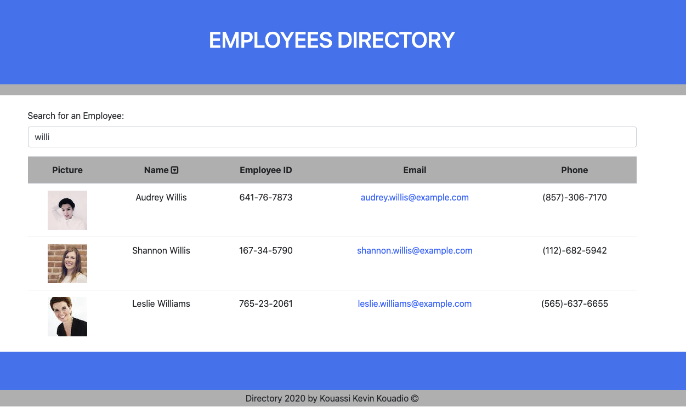

# React Employee Directory App  

## Description
It is an employee directory application developed with React using the ramdomuser API. When the user loads the page, a table of employees renders with their pictures, names, employee id, email and phone number with the possibility to filer by typing in the input field and sorting by name.

## Table of contents
* [Description](#Description)
* [Link](#Link)
* [Usage](#Usage)
* [License](#License)
* [Contributing](#Contributing)
* [Screenshot](#Screenshot)
* [Questions](#Questions)

## Link
[Link to deployed App](https://kevkouadio.github.io/emolyee-directory/)

## Usage
Enter a letter in the input field to search. Click on the name arrow to sort by name.

## Licence
This app is under the MIT License.

## Contributing
I would be happy if anyone decide to improve it. All comments and suggestions are welcomed.

## Screenshot

## Questions
Contact me: kevkouadio@gmail.com

My Github: http://github.com/kevkouadio